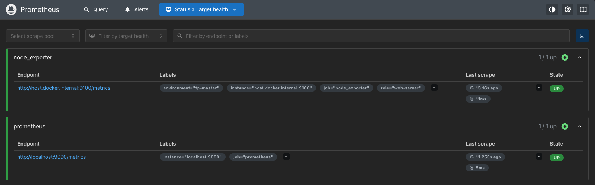
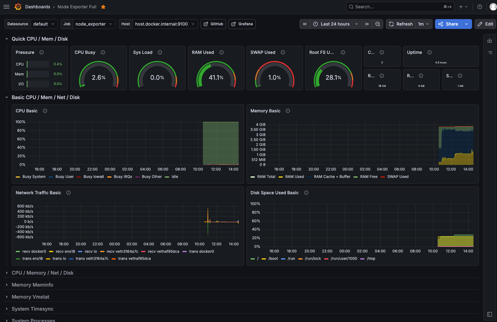

# Supervision d'infrastructure — Module Monitoring

**École :** LiveCampus - ESDID-26.2  
**Étudiant :** [Antoine MASIA](https://github.com/MasiaAntoine) - Full-Stack Developer  
**Intervenant :** [Tarik LF](https://github.com/TarikLF) - Formateur Cybersécurité & Infrastructures

---

## 📝 [Fiche de Révision](docs/fiche-revision.md)

**Pour comprendre rapidement tous les concepts du projet :**

- 🏗️ Modèle pull Prometheus & métriques `/metrics`
- 🎨 Dashboards Grafana (astreinte)
- 🔧 Alertmanager, inhibit rules & silences
- 🔐 SNMP, auditd, Fail2ban & scripts de détection
- 🚀 SLA, Uptime Kuma & rapports d'incident

👉 **[Voir la fiche de révision complète](docs/fiche-revision.md)**

---

## 📂 Réponses aux TP

| TP | Statut | Fichier |
|----|--------|---------|
| TP1 — Prometheus / Grafana | ✅ Complété | [reponses_tp1.md](docs/reponses_tp1.md) |
| TP2 — Alertmanager / Telegram | 🚧 En cours | [reponses_tp2.md](docs/reponses_tp2.md) |
| TP3 — SNMP / LibreNMS / MRTG | 🚧 En cours | [reponses_tp3.md](docs/reponses_tp3.md) |
| TP4 — auditd / Fail2ban | 🚧 En cours | [reponses_tp4.md](docs/reponses_tp4.md) |
| TP5 — Uptime Kuma / SLA | ⏳ À venir | — |

Énoncé complet : [cahier_tp.md](docs/cahier_tp.md)

---

<div align="center">

<table>
  <tr>
    <td align="center" width="50%">
      <a href="https://github.com/MasiaAntoine">
        
      </a>
      <br/>
      <strong>Antoine MASIA</strong>
      <br/>
      <em>Étudiant</em>
    </td>
    <td align="center" width="50%">
      <a href="https://github.com/TarikLF">
        
      </a>
      <br/>
      <strong>Tarik LF</strong>
      <br/>
      <em>Intervenant</em>
    </td>
  </tr>
</table>

<br>

<em>Projet réalisé dans le cadre du module "Monitoring"</em>

</div>

---

## Description du Projet

Mise en place d'une **chaîne de supervision complète** pour un parc Linux / réseau : collecte de métriques, visualisation, alerting temps réel, SNMP, détection de dérives sécurité, et suivi de disponibilité / SLA.

- 📊 Collecte système via **Prometheus** + **Node Exporter**
- 📈 Visualisation et dashboards d'astreinte avec **Grafana**
- 🚨 Alertes temps réel via **Alertmanager** (Telegram / Discord)
- 🌐 Supervision réseau **SNMP** (Net-SNMP, MRTG, LibreNMS)
- 🛡️ Détection d'intrusions / dérives (**auditd**, **Fail2ban**, scripts Python)
- ⏱️ Disponibilité externe et calcul de **SLA** avec **Uptime Kuma**

## Sommaire

- [Description du Projet](#description-du-projet)
- [Captures d'écran](#captures-décran)
- [Architecture du Projet](#architecture-du-projet)
  - [Architecture de supervision (pull)](#architecture-de-supervision-pull)
  - [Architecture des composants](#architecture-des-composants)
  - [Flux de l'application](#flux-de-lapplication)
- [Fonctionnalités](#fonctionnalités)
  - [Supervision système](#supervision-système)
  - [Alerting](#alerting)
  - [Supervision SNMP](#supervision-snmp)
  - [Sécurité système](#sécurité-système)
  - [Disponibilité & SLA](#disponibilité--sla)
- [Installation et Utilisation](#installation-et-utilisation)
  - [Prérequis](#prérequis)
  - [Configuration](#configuration)
  - [Démarrage](#démarrage)
  - [Réinitialisation de la base de données](#réinitialisation-de-la-base-de-données)
- [Technologies Utilisées](#technologies-utilisées)
- [Sécurité](#sécurité)
- [Configuration](#configuration-1)
- [Projet Pédagogique](#projet-pédagogique)

## Captures d'écran

### Cibles Prometheus (état UP)



_Page Status → Targets : jobs `prometheus` et `node_exporter` en état UP._

### Requête PromQL — utilisation CPU


_Graphique de la requête d'utilisation CPU sur 5 minutes (TP1 — Question 2)._

### Dashboard Node Exporter Full



_Dashboard communautaire 1860 : vue CPU, mémoire et système de fichiers._

### Dashboard Vue Astreinte


_Dashboard personnalisé : jauge CPU (seuils), uptime, disque `/`, trafic réseau._

---

## Architecture du Projet

### Architecture de supervision (pull)

La stack repose sur le **modèle pull** de Prometheus : le serveur interroge périodiquement chaque cible sur `/metrics`, stocke les séries temporelles, évalue les règles d'alerte, puis expose les données à Grafana et Alertmanager.

**Principe clé** : les exporters exposent les métriques ; Prometheus les récupère (pull), sans agent push côté machines supervisées (hors cas remote write).

### Architecture des composants

```
tp-monitoring/
├── prometheus/
│   └── prometheus.yml           # Jobs / targets de scrape
├── grafana/                     # Volume de données Grafana
│   └── dashboard_import/
│       └── vue-astreinte.json
├── docs/
│   ├── cahier_tp.md             # Énoncé complet des 5 TP
│   ├── fiche-revision.md
│   ├── reponses_tp1.md          # Réponses TP1
│   ├── reponses_tp2.md          # Réponses TP2 (en cours)
│   ├── reponses_tp3.md          # Réponses TP3 (en cours)
│   ├── reponses_tp4.md          # Réponses TP4 (en cours)
│   └── screenshots/             # Captures d'écran
```

### Flux de l'application

```
Hôte Linux
  └── Node Exporter (:9100 /metrics)
          ↑ scrape 15s
      Prometheus (:9090)
       ├──→ Grafana (:3000)          # visualisation
       └──→ Alertmanager (:9093)     # alerting
                └──→ relay.py / webhook → Telegram / Discord

Équipements réseau
  └── snmpd → MRTG / LibreNMS (:8000)

Disponibilité externe
  └── Uptime Kuma (:3001) → notifications IM + page de statut
```

**Caractéristiques :**

- ✅ Collecte centralisée (modèle pull)
- ✅ Visualisation métier (astreinte) + dashboard communautaire
- ✅ Alerting avec groupement, inhibition et silences
- ✅ Couverture perf + réseau SNMP + sécurité + SLA

### Pattern Exporter

Chaque domaine expose ses métriques via un **exporter** dédié (Node Exporter, blackbox, mysqld, cAdvisor…). Prometheus reste agnostique du système surveillé.

**Composants impliqués :**

- `node_exporter` : métriques OS (CPU, RAM, disque, réseau)
- `prometheus.yml` : définition des jobs / labels
- Grafana : requêtes PromQL → panels

**Avantages :**

- ✅ Découplage collecte / visualisation
- ✅ Cibles ajoutables sans modifier les dashboards (labels)
- ✅ Écosystème large d'exporters open source

---

## Fonctionnalités

### Supervision système

- **Description** : collecte et affichage des métriques matérielles / OS
- **Détails** :
  - Node Exporter en service systemd (port 9100)
  - Jobs Prometheus `prometheus` + `node_exporter`
  - Labels `environment` / `role` pour le filtrage

### Alerting

- **Description** : notifications temps réel dès franchissement de seuils
- **Détails** :
  - Règles `CPUEleve`, `DisqueCritique`, `InstanceDown`
  - Relais Python Flask → Telegram (ou webhook Discord)
  - Silences Alertmanager pour maintenance planifiée

### Supervision SNMP

- **Description** : supervision d'équipements sans agent Prometheus
- **Détails** :
  - Agent `snmpd` + communauté lecture seule pédagogique
  - Graphiques historiques MRTG
  - Inventaire et alertes via LibreNMS

### Sécurité système

- **Description** : détection de comportements anormaux
- **Détails** :
  - Surveillance sudo hors whitelist (`sudo_watch.py`)
  - Règles auditd persistantes (`/etc/passwd`, `su`)
  - Fail2ban sur SSH + scripts dérive NTP / quotas

### Disponibilité & SLA

- **Description** : suivi externe de la disponibilité et reporting
- **Détails** :
  - Moniteurs HTTP, TCP (SSH), Ping
  - Page de statut publique
  - Calcul SLA + rapport d'incident (post-mortem) en anglais

---

## Installation et Utilisation

### Prérequis

- Linux Debian / Ubuntu (VM) avec `sudo`
- Docker + Docker Compose
- Accès réseau aux ports 9090, 3000, 9100 (puis 9093, 8000, 3001 selon les TP)

### Configuration

1. **Cloner le projet** :

```bash
git clone https://github.com/livecampus-ESDID-26-2/tp-monitoring.git
cd tp-monitoring
```

2. **Configurer les variables d'environnement** :

Aucune configuration `.env` obligatoire pour le TP1.  
Pour le TP2, renseigner le token Telegram / webhook Discord dans `relay.py` (ne pas committer de secrets).

### Démarrage

3. **Node Exporter (hôte)** — voir [cahier_tp.md](docs/cahier_tp.md) (service systemd sur le port 9100).

4. **Prometheus + Grafana** :

```bash
docker run -d --name prometheus \
  --add-host=host.docker.internal:host-gateway \
  -p 9090:9090 \
  -v ~/tp-monitoring/prometheus/prometheus.yml:/etc/prometheus/prometheus.yml \
  prom/prometheus

docker run -d --name grafana \
  -p 3000:3000 \
  -v ~/tp-monitoring/grafana:/var/lib/grafana \
  grafana/grafana-oss
```

5. **Accéder aux interfaces** :

| Service | URL | Identifiants |
|---------|-----|--------------|
| Prometheus | http://\<ip_vm\>:9090 | — |
| Grafana | http://\<ip_vm\>:3000 | `admin` / `admin` |
| Node Exporter | http://localhost:9100/metrics | — |

6. **Arrêter les conteneurs** :

```bash
docker stop prometheus grafana
docker rm prometheus grafana
```

### Réinitialisation de la base de données

Non applicable au sens SGBD classique.  
Grafana stocke ses dashboards dans le volume `grafana/` (`grafana.db`). Pour repartir de zéro :

```bash
docker stop grafana && docker rm grafana
# sauvegarder puis vider le volume si besoin
docker run -d --name grafana -p 3000:3000 \
  -v ~/tp-monitoring/grafana:/var/lib/grafana \
  grafana/grafana-oss
```

---

## Technologies Utilisées

### Backend / Collecte

- **Prometheus** : TSDB, scrape, PromQL, règles d'alerte
- **Node Exporter** : métriques système Linux
- **Python / Flask** : relais webhook Alertmanager → Telegram (TP2)
- **auditd / Fail2ban** : traçabilité et protection brute-force (TP4)

### Architecture

- **Modèle pull** : Prometheus scrapes les exporters
- **Labels** : multi-environnements / rôles
- **Exporters** : découplage collecteur / cible

### Frontend / Visualisation

- **Grafana OSS** : dashboards, jauges, timeseries, stats
- **Uptime Kuma** : moniteurs et page de statut (TP5)
- **LibreNMS / MRTG** : inventaire et graphiques SNMP (TP3)

### Infrastructure

- **Docker** : Prometheus, Grafana, Alertmanager, LibreNMS, Uptime Kuma
- **systemd** : service Node Exporter persistant
- **iptables** : actions Fail2ban / simulations de panne

---

## Sécurité

### Sécurité de l'application

✅ **Exposition limitée** : services bindés sur la VM de TP, pas d'exposition Internet non contrôlée  
✅ **Grafana** : changement du mot de passe `admin` recommandé après première connexion  
✅ **Secrets** : tokens Telegram / webhooks hors dépôt Git  
✅ **SNMP pédagogique** : communauté `ro` restreinte par plage IP ; rappel SNMPv3 en production  
✅ **Fail2ban** : ban temporaire après échecs SSH répétés  
✅ **auditd** : journalisation des accès sensibles (`passwd`, `su`)

### Sécurité de la base de données

Non applicable (pas de SGBD applicatif métier). Les données Grafana sont locales au volume Docker.

### Sécurité des notifications & opérations

✅ **Silences Alertmanager tracés** (auteur + commentaire) plutôt que mute client  
✅ **Inhibit rules** pour réduire le bruit d'alertes  
✅ **Scripts whitelist sudo** pour détecter les élévations anormales

---

## Configuration

### Prometheus (`prometheus/prometheus.yml`)

```yaml
global:
  scrape_interval: 15s
  evaluation_interval: 15s

scrape_configs:
  - job_name: 'prometheus'
    static_configs:
      - targets: ['localhost:9090']

  - job_name: 'node_exporter'
    static_configs:
      - targets: ['host.docker.internal:9100']
        labels:
          environment: 'tp-master'
          role: 'web-server'
```

Version commentée : voir [reponses_tp1.md](docs/reponses_tp1.md).

### Ports utilisés

| Service | Port |
|---------|------|
| Prometheus | 9090 |
| Grafana | 3000 |
| Node Exporter | 9100 |
| Alertmanager | 9093 |
| Relais Flask | 5000 |
| LibreNMS | 8000 |
| Uptime Kuma | 3001 |

---

## Projet Pédagogique

Ce projet fait partie du module **« Monitoring »** à **LiveCampus - ESDID-26.2** et démontre :

### Compétences techniques

#### Collecte & métriques

- ✅ **Modèle pull Prometheus** : scrape, targets, labels
- ✅ **PromQL** : `rate`, agrégations, calculs de charge
- ✅ **Exporters** : Node Exporter en service systemd

#### Visualisation & alerting

- ✅ **Grafana** : datasource, import dashboard, panels métier
- ✅ **Alertmanager** : routes, inhibit, silences
- ✅ **Notifications IM** : Telegram / Discord via webhook

#### Réseau & sécurité

- ✅ **SNMP** : snmpd, OID/MIB, MRTG, LibreNMS
- ✅ **auditd / Fail2ban** : traçabilité et anti brute-force
- ✅ **Scripts Python** : détection sudo, dérive NTP, quotas

#### Disponibilité

- ✅ **Uptime Kuma** : moniteurs externes et status page
- ✅ **SLA** : calcul de disponibilité contractuelle
- ✅ **Post-mortem** : rapport d'incident structuré (UTC, anglais)

### Fonctionnalités avancées

- 📊 Dashboard **Vue Astreinte** avec seuils couleur CPU
- 🚨 Chaîne d'alerting bout-en-bout (règle → IM → resolved)
- 🌐 Inventaire SNMP auto-découvert
- 🛡️ Bannissement SSH automatisé
- ⏱️ Suivi SLA 99,9 % et page de statut publique
- 📝 Documentation pédagogique (cahier + réponses + fiche révision)

### Bonnes pratiques

- **Infrastructure as Code légère** : configs versionnées (`prometheus.yml`, dashboards JSON)
- **Séparation des secrets** : tokens hors Git
- **Observabilité en couches** : interne (Prometheus) + externe (Uptime Kuma)
- **Réduction du bruit** : inhibit rules + silences commentés
- **Traçabilité** : auditd + journaux + rapports d'incident
- **Reproductibilité** : Docker pour les services de supervision
