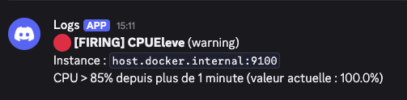
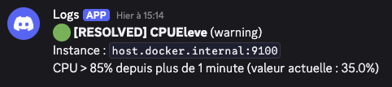
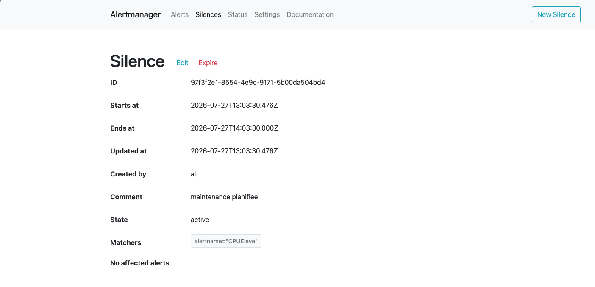

# Réponses TP2 — Alerting Alertmanager / Discord

Stack : Prometheus → Alertmanager → `monitoring/relay.py` → webhook Discord.

---

## Question 1 — Rôle de `inhibit_rules`

La section `inhibit_rules` permet de **supprimer (inhiber) certaines alertes** quand une autre alerte plus grave est déjà active.

Dans notre config :

- si une alerte **critical** est active sur une `instance`
- alors les alertes **warning** de **la même instance** ne sont plus notifiées

C’est pertinent parce qu’une panne critique (ex. `InstanceDown` ou disque plein) rend souvent les warnings secondaires (CPU élevé, etc.) redondants. Sans inhibition, l’astreinte reçoit un **flot de messages** alors qu’il faut traiter la cause principale. On réduit le bruit et on garde le focus sur l’alerte prioritaire.

---

## Question 2 — Notifications firing / resolved

Test réalisé avec `stress` (charge CPU) pour déclencher `CPUEleve`, puis arrêt de la charge pour la résolution.

### Notification FIRING

### Notification RESOLVED

---

## Question 3 — Silences et traçabilité SOC

Dans un SOC, un silence doit être **traçable** : qui l’a créé (`Creator`) et pourquoi (`Comment`, ex. « maintenance planifiée »).

Couper les notifs uniquement sur le client Discord :

- ne laisse **aucune preuve** dans l’outil d’alerting
- empêche l’équipe de savoir qu’une alerte a été volontairement masquée
- crée un risque de **trou de couverture** non audité (alerte réelle ignorée sans justification)

Avec Alertmanager, le silence est centralisé, horodaté, consultable par toute l’équipe, et peut être corrélé aux tickets / maintenances — indispensable pour l’audit et le post-incident.

---

## Livrables

| Fichier | Rôle |
|---------|------|
| `monitoring/prometheus/alert_rules.yml` | Règles `CPUEleve`, `DisqueCritique`, `InstanceDown` |
| `monitoring/alertmanager/alertmanager.yml` | Routes, receivers Discord, `inhibit_rules` |
| `monitoring/relay.py` | Relais webhook Alertmanager → Discord |
| Captures | firing, resolved, silence |
