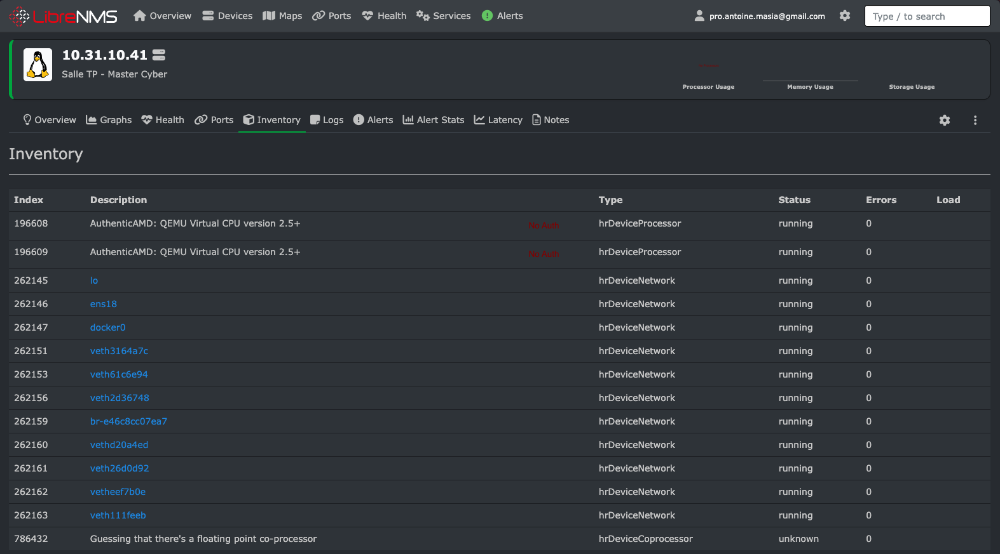
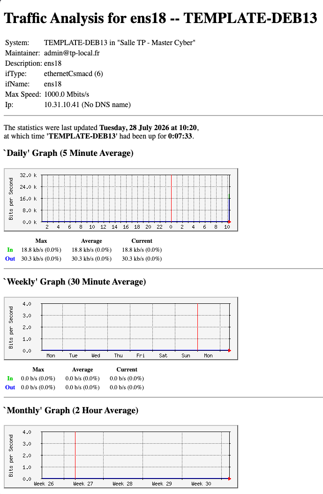
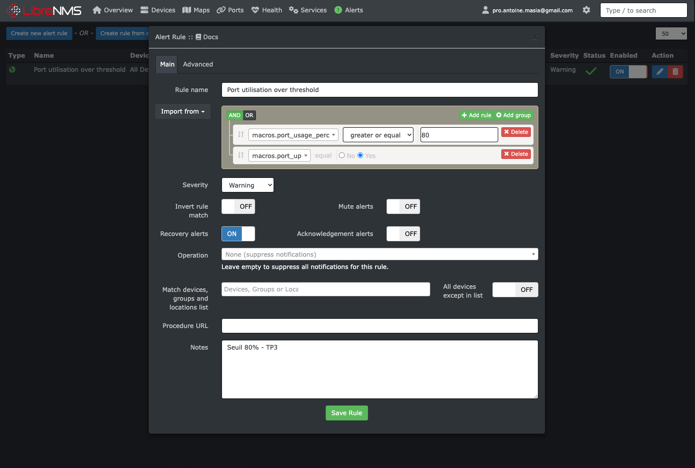

# Réponses TP3 — Supervision SNMP / LibreNMS / MRTG

Stack : `snmpd` (VM) → MRTG + LibreNMS (Docker Compose).

---

## Question 1 — Niveaux de sécurité SNMPv3

SNMPv1/v2c envoient la **communauté en clair**. SNMPv3 introduit trois niveaux :

| Niveau | Auth | Chiffrement | Usage |
|--------|------|-------------|--------|
| **noAuthNoPriv** | Non | Non | Identité utilisateur seule, peu sécurisé (proche v2c) |
| **authNoPriv** | Oui (MD5/SHA) | Non | Authentifie l’émetteur, charge utile encore lisible |
| **authPriv** | Oui | Oui (DES/AES) | Auth + confidentialité — **recommandé en production** |

En TP on a utilisé SNMPv2c (`tp-master-ro`) pour la simplicité ; en prod on passerait à **authPriv**.

---

## Question 2 — Identification des OID

| OID | Signification (MIB-2 / HOST-RESOURCES) |
|-----|----------------------------------------|
| `1.3.6.1.2.1.1.5.0` | **sysName** — nom d’hôte administré (ici `TEMPLATE-DEB13`) |
| `1.3.6.1.2.1.25.3.3.1.2` | **hrProcessorLoad** — charge CPU (%) par processeur (HOST-RESOURCES-MIB) |

Branche complète pour `sysName` :

```text
iso.org.dod.internet.mgmt.mib-2.system.sysName.0
= 1.3.6.1.2.1.1.5.0
```

> Sur cette VM QEMU, `hrProcessorLoad` peut répondre « No Such Instance » ; les CPU apparaissent quand même dans `hrDevice` (visible dans l’inventaire LibreNMS).

---

## Question 3 — Inventaire auto-découvert

Trois infos **non configurées à la main** dans LibreNMS, remontées par SNMP :

1. **Processeurs** (`AuthenticAMD: QEMU Virtual CPU…`, type `hrDeviceProcessor`) — via HOST-RESOURCES-MIB (`hrDevice`)
2. **Interfaces réseau** (`ens18`, `lo`, `docker0`, `veth…`) — via IF-MIB / `hrDeviceNetwork`
3. **OS / kernel** (`Linux 6.12.94+deb13-amd64`) et **sysLocation** — via `sysDescr` / `sysLocation` (MIB-2 `system`)

Mécanisme : LibreNMS interroge l’agent (`snmpwalk`/`snmpget` sur les branches MIB) ; l’agent lit le système et renvoie les OID — d’où la découverte automatique.



---

## Captures MRTG



---

## Alerte LibreNMS (étape 5)

Règle créée : **Port utilisation over threshold**

```text
macros.port_usage_perc >= 80 AND macros.port_up = 1
```

Sévérité : Warning — tous les devices.



Transport Discord : **non finalisé** (contrainte SSL / complexité lab). La règle d’alerte native est en place ; le transport pourra être branché plus tard (mail local ou webhook).

---

## Fichier `snmpd.conf` commenté

```conf
# snmpd.conf — TP3 Master Cyber (version commentée / livrable)
# Agent SNMP en lecture seule sur la VM (équipement simulé)
# ATTENTION pédagogique : SNMPv2c = communauté en clair. En prod → SNMPv3.

# -----------------------------------------------------------------------------
# Communauté lecture seule (ro = read-only)
# Adaptée au réseau réel de la VM (10.31.0.0/16) + localhost + réseaux Docker
# (Compose utilise souvent 172.18.0.0/16, pas seulement 172.17.0.0/16)
# -----------------------------------------------------------------------------
rocommunity tp-master-ro  127.0.0.1
rocommunity tp-master-ro  10.31.0.0/16
rocommunity tp-master-ro  172.16.0.0/12

# Métadonnées système exposées via SNMP (MIB-2 system)
syslocation  "Salle TP - Master Cyber"
syscontact   admin@tp-local.fr

# sysservices : masque des services offerts (72 = applications + end-to-end)
sysservices  72

# Écoute UDP/161 sur toutes les interfaces (nécessaire pour LibreNMS en Docker)
agentaddress  udp:161
```

---

## Livrables

| Élément | Emplacement |
|---------|-------------|
| `snmpd.conf` commenté | section ci-dessus (+ copie `monitoring/snmp/snmpd.conf`) |
| Capture MRTG | `screenshots/mrtg_graphs.png` |
| Capture inventaire LibreNMS | `screenshots/librenms_inventory.png` |
| Capture règle d’alerte | `screenshots/librenms_alert_rule.png` |
| Stack LibreNMS | `monitoring/librenms/docker-compose.yml` |
