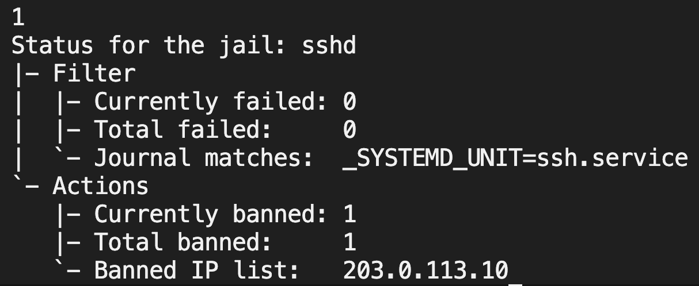
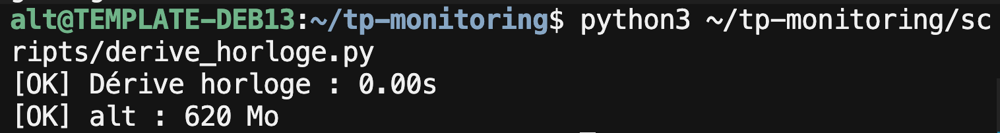

# Réponses TP4 — auditd, Fail2ban et scripts maison

---

## Question 1 — journalctl : boots des 7 derniers jours

```bash
journalctl --list-boots --since "7 days ago"
```

Cette commande liste les démarrages (boot ID + dates de début/fin) sur la période.  
Pour le détail d’un boot : `journalctl -b <id>` ou `journalctl -b -1` (boot précédent).

---

## Question 2 — Test `sudo_watch.py` + évolution Discord

Test : utilisateur `alt` hors whitelist `{admin, deploy}` → alerte console lors d’un `sudo true`.

**Évolution Discord (déjà intégrée dans le script)** : si `DISCORD_WEBHOOK_URL` est défini (comme au TP2), l’alerte est aussi postée sur le webhook au lieu d’être seulement affichée.

```bash
set -a && source ~/tp-monitoring/.env && set +a
sudo -E python3 scripts/sudo_watch.py
# autre terminal :
sudo true
```

Principe : remplacer / compléter le `print()` par un `POST` JSON `{"content": "..."}` vers le webhook Discord (avec `User-Agent`).

---

## Question 3 — Persistance des règles auditd

Règles déployées dans `/etc/audit/rules.d/audit.rules` (copie du dépôt `audit/audit.rules`) :

```conf
-w /etc/passwd -p wa -k surveillance_passwd
-w /usr/bin/su -p x -k surveillance_su
```

**Pourquoi `auditctl` seul ne suffit pas :**  
`auditctl` charge les règles **en mémoire** (runtime). Au redémarrage, le noyau repart sans ces règles. Les fichiers dans `/etc/audit/rules.d/` sont rechargés au boot via `augenrules` / `audit-rules.service` → configuration **durable**.

---

## Question 4 — Dérive d’horloge et sécurité

Une dérive non maîtrisée pose problème car :

1. **Corrélation de logs** : si machine A est en avance de 2 min sur B, un même incident apparaît à des horodatages différents → timelines d’investigation faussées, faux « avant/après ».
2. **Certificats TLS** : la validité (`NotBefore` / `NotAfter`) dépend de l’heure locale. Une horloge trop décalée fait échouer TLS (certificat « pas encore valide » ou « expiré ») et casse mTLS, API, HTTPS.
3. Kerberos / tokens JWT / MFA basés sur le temps sont également impactés.

D’où l’intérêt de NTP/chrony + supervision de la dérive (`derive_horloge.py`).

---

## Captures





---

## Livrables

| Élément | Emplacement |
|---------|-------------|
| `sudo_watch.py` | `scripts/sudo_watch.py` |
| `derive_horloge.py` | `scripts/derive_horloge.py` |
| Règles auditd persistantes | `audit/audit.rules` (→ `/etc/audit/rules.d/`) |
| `jail.local` | `fail2ban/jail.local` |
| Capture Fail2ban | `screenshots/fail2ban_ban.png` |
| Capture derive_horloge | `screenshots/derive_horloge.png` |
| Cron 30 min | `*/30 * * * * ... derive_horloge.py >> logs/derive_horloge.log` |
| Réponses Q1–Q4 | ce fichier |
