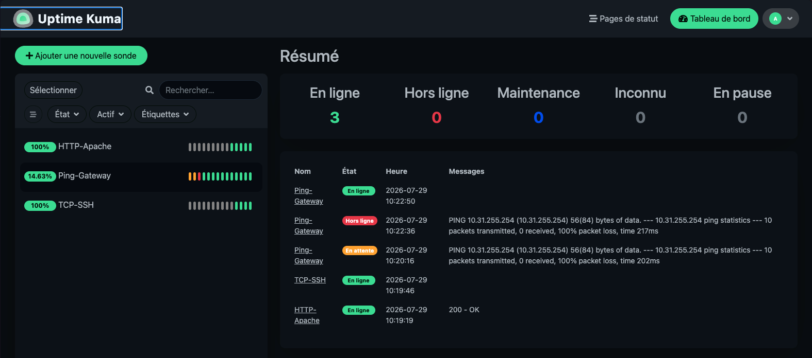
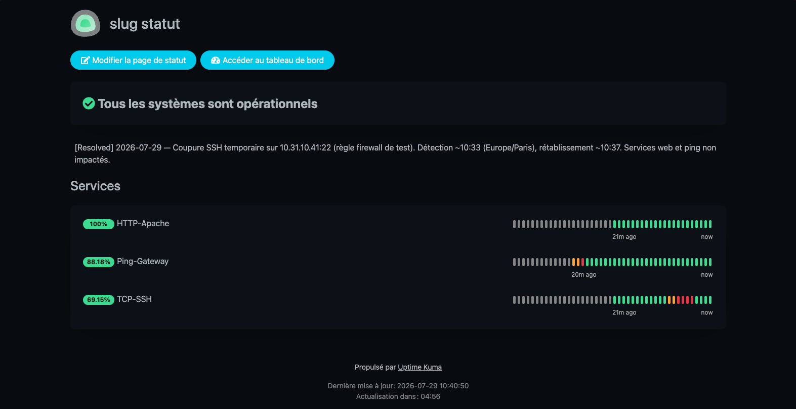

# Réponses TP5 — Uptime Kuma, SLA et rapport d'incident

Stack : Uptime Kuma (`:3001`) → 3 moniteurs + Discord ; page de statut publique ; rapport EN.

---

## Question 1 — Calcul de SLA mensuel

**Données :** mois de 30 jours ; incidents : 12 min + 1 h 47 + 8 min.

| Élément | Calcul | Résultat |
|---------|--------|----------|
| Durée du mois | 30 × 24 × 60 | **43 200 min** |
| Indisponibilité | 12 + 107 + 8 | **127 min** |
| Disponibilité | (43 200 − 127) / 43 200 × 100 | **≈ 99,706 %** |
| Budget 99,9 % | 0,1 % × 43 200 | **≈ 43,2 min** max |

**Verdict :** 127 min > 43,2 min → l’engagement **99,9 % n’est pas respecté**  
(équivalent tableau cahier : max ~43 min 50 s / mois).

---

## Question 2 — Status page clients vs dashboard d’astreinte

| | **Page de statut (clients)** | **Dashboard interne (astreinte)** |
|--|------------------------------|-----------------------------------|
| **Public** | Oui (URL publique) | Non (équipe Ops / SRE) |
| **Objectif** | Transparence contractuelle / confiance | Diagnostic et action rapide |
| **Niveau de détail** | Haut niveau : Up/Down, message d’incident | Technique : latence, erreurs, historiques fins, config |

**À masquer au public :** IPs internes, ports sensibles, URLs d’admin, messages d’erreur bruts, noms d’hôtes internes, détails firewall / runbooks, webhooks, credentials, métriques trop granulaires pouvant aider un attaquant.

La page « Statut des services » montre l’état des 3 sondes + un message d’incident résolu, sans exposer la config Ops.

---

## Question 3 — Pourquoi UTC dans les rapports d’incident

Les équipes internationales (et les outils) ne partagent pas le même fuseau. **UTC** est un référentiel unique : une même timeline se lit sans conversion ambiguë.

**Exemple de confusion évitée :** un ops à Paris note « 10:33 », un collègue à New York lit « 10:33 » comme heure locale → décalage de 6 h. Avec **08:33 UTC**, tout le monde aligne détection, Discord et logs sans erreur.

---

## Captures

| Capture | Fichier |
|---------|---------|
| Dashboard (3 moniteurs Up) | [`screenshots/uptime_kuma_dashboard.png`](screenshots/uptime_kuma_dashboard.png) |
| Panne SSH simulée | [`screenshots/uptime_kuma_down.png`](screenshots/uptime_kuma_down.png) |
| Notif Discord (Down) | [`screenshots/discord_uptime.png`](screenshots/discord_uptime.png) |
| Status page publique | [`screenshots/uptime_kuma_status_page.png`](screenshots/uptime_kuma_status_page.png) |

---

## Livrables

| Élément | Emplacement |
|---------|-------------|
| Calcul SLA (Q1) | section ci-dessus |
| Captures Uptime Kuma | `screenshots/` |
| Rapport d'incident (EN) | [`incident_report_tp5.md`](incident_report_tp5.md) |
| Réponses Q2–Q3 | ce fichier |
