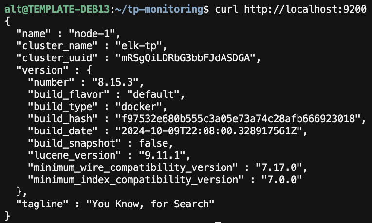

# Réponses — Installation stack ELK 8.x

Stack : Elasticsearch · Logstash · Kibana **8.15.3** via Docker Compose (`elk/`).

> **Note lab :** le cahier décrit une install `apt` + `systemctl`. Sur cette VM, sans `sudo` non interactif, l’équivalent Docker a été utilisé : **mêmes ports**, **même config lab** (security off), **même pipeline de test**. Les fichiers `elk/elasticsearch/elasticsearch.yml` et `elk/kibana/kibana.yml` documentent les réglages du guide.

Énoncé : [`cahier_tp_elk.md`](cahier_tp_elk.md)

---

## Prérequis vérifiés

| Critère | Valeur machine |
|---------|----------------|
| OS | Debian 13 (trixie) |
| RAM | ~8 Go |
| Disque libre | ~9 Go (juste mais OK pour le lab) |

---

## Installation (Docker)

```bash
cd elk
docker compose up -d
```

Config lab appliquée :

| Paramètre | Valeur |
|-----------|--------|
| `cluster.name` | `elk-tp` |
| `node.name` | `node-1` |
| `network.host` / ports | `0.0.0.0` — ES `9200`, Kibana `5601` |
| `xpack.security.enabled` | `false` (**lab uniquement**) |
| Pipeline Logstash | `elk/logstash/pipeline/test.conf` → index `logstash-test` |

Le pipeline cahier utilisait `stdin {}` (interactif). En service Docker on utilise un `heartbeat` (événements `source: test-tp`) pour garder Logstash **Up**. Variante stdin : `elk/logstash/examples/test.stdin.conf.example`.

---

## Checklist finale (§8)

| Check | Résultat |
|-------|----------|
| Elasticsearch `http://localhost:9200` | ✅ JSON + tagline *You Know, for Search* |
| Cluster | `elk-tp` / nœud `node-1` |
| Index `logstash-test` | ✅ créé (docs de test présents) |
| Kibana `http://10.31.10.41:5601` | ✅ HTTP 200 |
| 3 services Up | ✅ `docker compose ps` |

### Test Elasticsearch

```bash
curl http://localhost:9200
```



### Index Logstash

```bash
curl 'http://localhost:9200/_cat/indices/logstash-test?v'
```

### Interface Kibana

Ouvrir : [http://10.31.10.41:5601](http://10.31.10.41:5601)


---

## Commandes utiles

```bash
cd ~/tp-monitoring/elk
docker compose ps
docker compose logs -f elasticsearch
docker compose logs -f kibana
docker compose logs -f logstash
docker compose restart
docker compose down          # arrêt
curl http://localhost:9200/_cat/indices?v
```

---

## Livrables

| Élément | Emplacement |
|---------|-------------|
| Compose + configs | `elk/` |
| Réponses / checklist | ce fichier |
| Captures | `screenshots/elk_elasticsearch.png`, `elk_kibana.png` |
