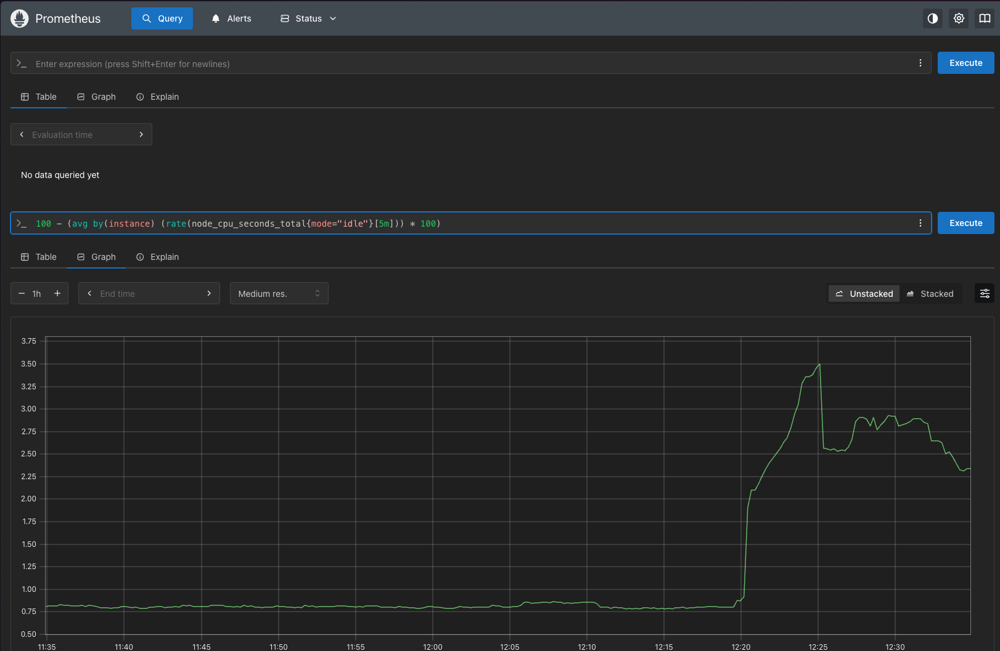
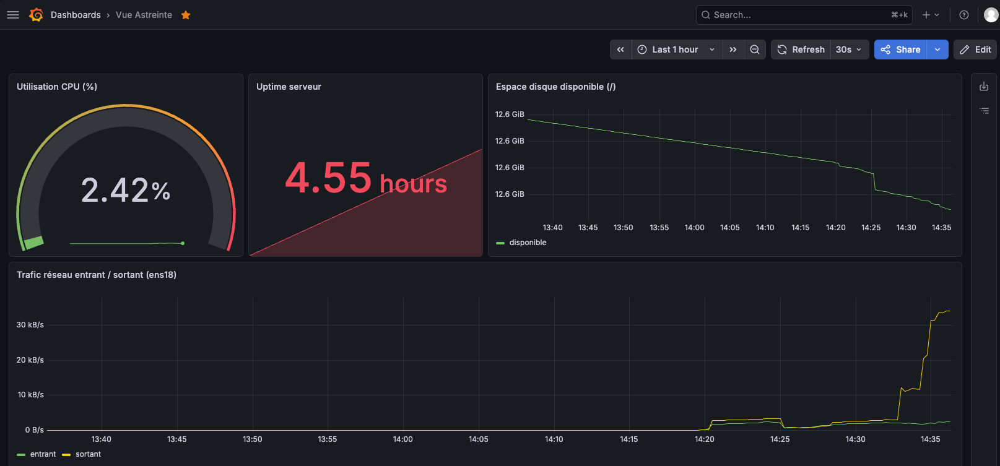

# TP1 — Supervision Prometheus / Node Exporter / Grafana

Réponses aux questions du TP (stack déjà déployée).

---

## Question 1 — Familles de métriques `/metrics`

| Domaine | Métrique | Type |
|---------|----------|------|
| CPU | `node_cpu_seconds_total` | **counter** |
| Mémoire | `node_memory_MemAvailable_bytes` | **gauge** |
| Fichiers | `node_filesystem_avail_bytes` | **gauge** |

- **CPU** : temps cumulé passé dans chaque mode (`idle`, `user`, `system`…) — d’où le type *counter*.
- **Mémoire** : quantité de RAM encore utilisable à l’instant T — *gauge*.
- **Fichiers** : espace libre restant sur chaque montage — *gauge*.


---

## Question 2 — Requête PromQL

```promql
100 - (avg by(instance) (rate(node_cpu_seconds_total{mode="idle"}[5m])) * 100)
```

Calcule le **taux d’utilisation CPU (%)** sur 5 minutes :

1. `rate(...[5m])` → part de temps CPU en mode `idle` (0 à 1)
2. `avg by(instance)` → moyenne sur tous les cœurs
3. `* 100` → pourcentage d’inactivité
4. `100 - …` → pourcentage d’occupation CPU



---

## Question 3 — 3 panels prioritaires pour l’astreinte de nuit

1. **CPU Usage** — Première cause de lenteur ou de saturation. Une charge anormale la nuit signale souvent un job runaway ou une attaque.
2. **Memory Available / Used** — Une RAM qui s’épuise mène au swap puis à des OOM kills, souvent sans alerte métier claire.
3. **Filesystem Space Available (root `/`)** — Disque plein = logs bloqués, écritures en échec, services qui tombent. À surveiller en priorité sur une machine unique.


---

## Dashboard Vue Astreinte

Jauge CPU (seuils vert / orange / rouge), espace disque `/`, trafic réseau `ens18`, uptime serveur.



---

## Fichier `prometheus.yml` commenté

```yaml
# Configuration Prometheus — TP1 Master Cybersécurité
# Modèle pull : Prometheus interroge périodiquement chaque cible /metrics

global:
  # Fréquence de collecte des métriques
  scrape_interval: 15s
  # Fréquence d'évaluation des règles d'alerte (si définies)
  evaluation_interval: 15s

scrape_configs:

  # Auto-supervision de Prometheus lui-même
  - job_name: 'prometheus'
    static_configs:
      - targets: ['localhost:9090']

  # Métriques système (CPU, RAM, disque, réseau) via Node Exporter sur l'hôte
  # host.docker.internal = passerelle vers la machine hôte depuis le conteneur
  - job_name: 'node_exporter'
    static_configs:
      - targets: ['host.docker.internal:9100']
        labels:
          environment: 'tp-master'
          role: 'web-server'
```
